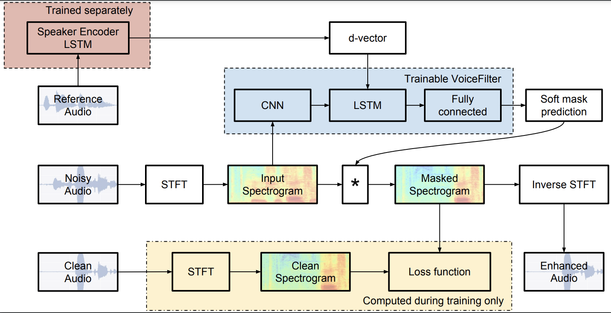

### Voice Separation
____

Implementation of the VoiceFilter model using Torchaudio and Pytorch Lightning. 

#### Architecture
____

#### Checkpoints
----

Embedder: [link](https://drive.google.com/file/d/1TRXK7SaiTdiALxOfswjh7sb2Pt9JB-nc/view?usp=sharing)

VoiceFilter (best - ReLU): [link](https://drive.google.com/file/d/1RBsmZ9pIkYKuemjun8Xv8ACpZIlca077/view?usp=sharing) 

VoiceFilter (best - Mish): [link](https://drive.google.com/file/d/1x5_p2LgEQrTpk4HTEFtkz1EVmarEc9i5/view?usp=sharing)